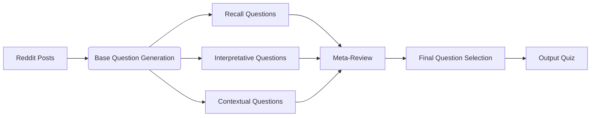

# Popheads Quiz Generator: LLM-Powered Question Creation

Transform top posts from r/popheads into engaging quiz questions using advanced LLM workflows. This project demonstrates how to leverage language models for automated content generation with contextual awareness.

## Workflow Overview

Key Features

🎯 Triple-Question Generation\
Creates three distinct question types for comprehensive coverage\
🔍 Meta-Review System\
Refines questions using post-specific context\
� Intelligent Selection\
Chooses optimal final question through comparative analysis\
📊 Reddit Integration\
Processes real-world content from r/popheads
